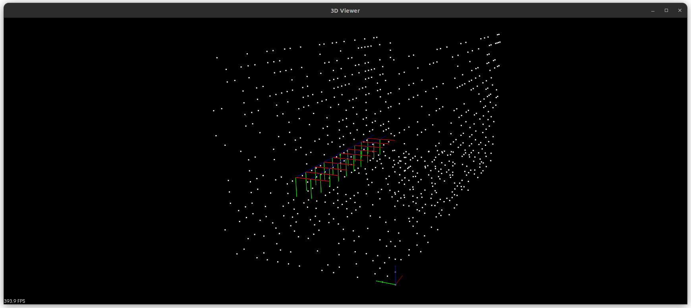

# vslam
Stereo VO/SLAM simulation 

Stereo VO/VSLAM simulation I created because I wanted to build this from scratch. Ideally I could also include IMU measurements but that'll be left for later. There's a lot to do still but it looks like the frame-to-frame motion estimator is working. The bundle adjuster backend is in progress. The plan is to develop two solutions to the front and back ends using both Ceres solver and gtsam.  

### TODO: Frame-to-Frame Estimator

- [X] Create this using Ceres solver
- [ ] Figure out why some iterations have infinite cost
- [ ] Create a stereo VO class to abstract usage
- [ ] Clean up unit test and utilities
- [ ] Create front end using gtsam batch fixed lag smoother

### TODO: Bundle Adjuster

- [ ] Verify correctness in simulation
- [ ] Create this using Ceres solver
- [ ] Create this using gtsam

